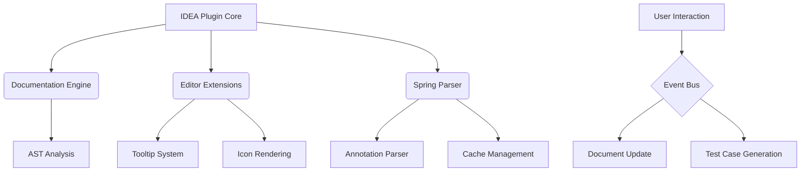

# springDocHelper

# Spring Interface Documentation Helper

<!-- Plugin description -->
**Comprehensive API Documentation Solution for Spring Developers**

## Core Features
- 🚀 **Efficient Development**: Instant API documentation generation and real-time preview
- 📐 **Professional Output**: Multi-format export (HTML/JSON/Markdown/cURL)
- 🔄 **Test Case Generation**: Create Postman/Yapi compatible test cases with one click
- 🧠 **Advanced Type Inference**: Accurate parsing of complex generic return types

## Key Capabilities
### Smart Documentation
- Mouse-hover display (class, field, response, parameters, methods)
- Swagger document parsing integration
- Dynamic type inference for complex generic structures

### Visual Operations
- HTTP method icons (GET/POST/PUT/DELETE) in editor gutter
  - Click to copy documentation
  - Generate test cases
  - Method responsibility chain tracking (WIP)

### Efficient Search System
- Double-shift global search (Search Everywhere)
  - Wildcard* matching
  - Word/regex search
  - HTTP method filtering (GET/POST etc.)
  - Case sensitivity control

### Performance Optimization
- Smart caching: LRU strategy + 10-minute auto-expiration
- Memory optimization: Efficient memory management via Caffeine framework

<!-- Plugin description end -->

## Technical Architecture

## Developer Guide
### Build Requirements
- JDK 17+
- Kotlin JVM Toolchain 17
- IntelliJ Platform Gradle Plugin 2025.1.1
- Gradle 8.9

### Tech Stack
- **Frontend**: IntelliJ UI components + Kotlinx-html
- **Backend**: Kotlin coroutines + Java 17
- **Build**: Gradle + Qodana code quality check
- **Testing**: JUnit5 + Mockito

## Installation Guide
### Online Installation
<kbd>Settings/Preferences</kbd> > <kbd>Plugins</kbd> > <kbd>Marketplace</kbd> > <kbd>Search "spring-doc-helper"</kbd> > <kbd>Install</kbd>

### Offline Installation
1. Download [latest release](https://github.com/OptimisticGeek/spring-doc-helper/releases/latest)
2. Use <kbd>Settings/Preferences</kbd> > <kbd>Plugins</kbd> > <kbd>⚙️</kbd> > <kbd>Install plugin from disk</kbd>

## Contribution Guidelines
Welcome contributions! Please refer to our [Contributing Guide](CONTRIBUTING.md) for development instructions.

## License
This project uses Apache-2.0 License. See [LICENSE](LICENSE) for details.

---
Plugin based on the [IntelliJ Platform Plugin Template][template].

[template]: https://github.com/JetBrains/intellij-platform-plugin-template
[docs:plugin-description]: https://plugins.jetbrains.com/docs/intellij/plugin-user-experience.html#plugin-description-and-presentation