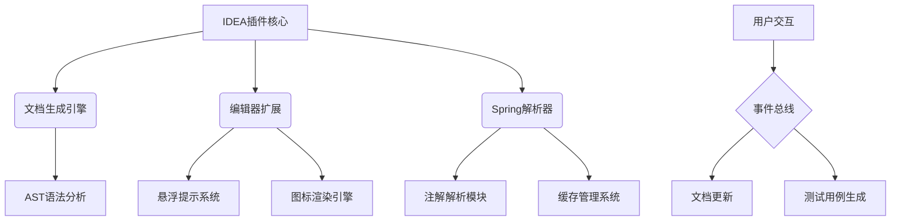

# springDocHelper

# Spring接口文档智能助手
**为Spring开发者打造的全方位API文档解决方案**

## 核心价值
- 🚀 提升开发效率：毫秒级接口文档生成与实时预览
- 📐 专业级文档输出：支持HTML/JSON/Markdown/cURL多格式导出
- 🔄 智能测试用例生成：一键创建可导入Postman/Yapi的测试用例
- 🧠 先进类型推断：精准解析泛型返回值的真实类型结构

## 主要特性
### 智能文档展示
- 鼠标悬浮即时显示（类、字段、响应、参数、方法）
- 支持Swagger文档解析与集成
- 动态类型推断引擎，完美处理复杂泛型结构

### 可视化操作
- 左侧HTTP方法图标系统（GET/POST/PUT/DELETE）
  - 点击复制文档内容
  - 一键生成测试用例
  - 方法责任链追溯（开发中）

### 高效搜索系统
- 双击Shift全局搜索接口（Search Everywhere）
  - 支持通配符*匹配
  - 单词/正则精确搜索
  - HTTP方法过滤（GET/POST等）
  - 大小写敏感控制

### 性能优化
- 智能缓存机制：LRU缓存策略 + 10分钟自动过期
- 内存占用优化：通过Caffeine框架实现高效内存管理

## 技术架构

## 开发者指南
### 构建要求
- JDK 17+
- Kotlin JVM Toolchain 17
- IntelliJ Platform Gradle Plugin 2025.1.1
- Gradle 8.9

### 技术栈
- **前端**: IntelliJ UI组件 + Kotlinx-html
- **后端**: Kotlin协程 + Java 17
- **构建**: Gradle + Qodana代码质量检查
- **测试**: JUnit5 + Mockito

## 安装指南
### 在线安装
<kbd>Settings/Preferences</kbd> > <kbd>Plugins</kbd> > <kbd>Marketplace</kbd> > <kbd>搜索 "spring-doc-helper"</kbd> > <kbd>Install</kbd>

### 离线安装
1. 下载 [最新版本](https://github.com/OptimisticGeek/spring-doc-helper/releases/latest)
2. 通过 <kbd>Settings/Preferences</kbd> > <kbd>Plugins</kbd> > <kbd>⚙️</kbd> > <kbd>从磁盘安装插件</kbd>

## 贡献指南
欢迎贡献代码和改进建议！请参考我们的[贡献文档](CONTRIBUTING.md)了解如何参与开发。

## 许可协议
本项目采用 Apache-2.0 许可证。详情请查看 [LICENSE](LICENSE) 文件。

---
基于 [IntelliJ 平台插件模板][template] 开发

[template]: https://github.com/JetBrains/intellij-platform-plugin-template
[docs:plugin-description]: https://plugins.jetbrains.com/docs/intellij/plugin-user-experience.html#plugin-description-and-presentation